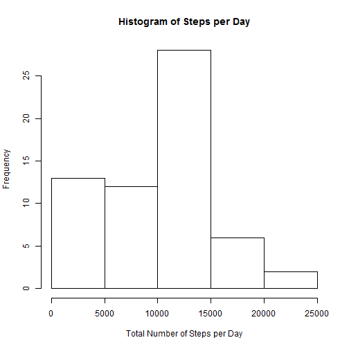
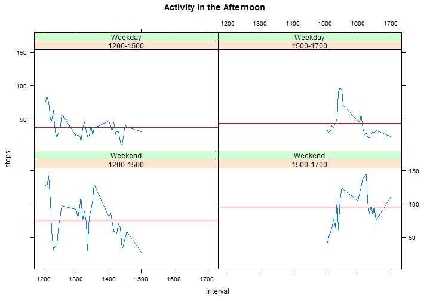

###Overview
We're given personal movement data and we're asked to find patterns from this dataset. 
Each question is a section that contains the answer, required plot(s), and R code (titled **R Code**) at the end of the section. Additional analysis is labeled as "*Additional Analysis*" in the report and R code. 

**The Dataset**

Steps data from a personal activity monitoring device is collected  at 5 minute intervals throughout the day. The data consists of two months of data from an anonymous individual collected during the months of October and November, 2012 and include the number of steps taken in 5 minute intervals each day.

####Short Answers
**1. Loading and preprocessing the data**

The date column that needs to cocerced to the right class (i.e. Date). In addition, there are 2,304 NAs in steps.

**2. What is mean total number of steps taken per day?**

* Mean: 9,354.23
* Median: 10,395

**3. What is the average daily activity pattern?**

The maximum number of steps - *206.17* - is at the interval: **835**. 

We further analysed the data by divvying up into 2 distinct sections: Morning Rush Hour (*800 to 1000*) and Evening Rush Hour (*1700 to 2000*).Mornings (*800 to 1000*) have **3.1X** more steps (114.46 steps) than the daily average of **37.38** steps. However, traditional evening rush hour (*1700 to 2000*) is only **1.6X** more steps (58.34 steps) than the daily average .


**4. Imputing missing values**

Replacing NAs in the dataset seem to converge both mean and median into 1 value.

* Total number of missing values: 2,304
* Interval mean: 37.38 & median: 34.11
* After input mean: 10766.19 & median: 10766.19


**5. Are there differences in activity patterns between weekdays and weekends?**

Yes. Overall activity level on weekdays is slightly less than weekends. Weekdays tend to get more activity during the mornings. However during the weekends, the reverse is true from afternoons onwards 


******

##Questions & Answers

###1.  Loading and preprocessing the data
******
Loading the data is easy. However there is a date column that needs to cocerced to the right class (i.e. Date) before we can run our analyses. 


```r
  activity <- read.csv("activity.csv")
  activity$date <- as.Date(activity$date)
```


Looking into the dataset shows 2,304 NAs in steps. We will have to account for these NAs during our analyses.


```r
  summary(activity)
```

```
##      steps             date               interval     
##  Min.   :  0.00   Min.   :2012-10-01   Min.   :   0.0  
##  1st Qu.:  0.00   1st Qu.:2012-10-16   1st Qu.: 588.8  
##  Median :  0.00   Median :2012-10-31   Median :1177.5  
##  Mean   : 37.38   Mean   :2012-10-31   Mean   :1177.5  
##  3rd Qu.: 12.00   3rd Qu.:2012-11-15   3rd Qu.:1766.2  
##  Max.   :806.00   Max.   :2012-11-30   Max.   :2355.0  
##  NA's   :2304
```


###2.  What is mean total number of steps taken per day?
******


The mean & median number of steps per day is **9354.00** and **10395.00** respectively.

Greatest activity categories are within *1,000 to 1,500* steps.

 

**R Code** 

```r
  activitySum <- aggregate(steps ~ date, data = activity, sum, na.rm=TRUE, na.action=NULL)
  
  meanTotal <- mean(activitySum$steps)
  medianTotal <- median(activitySum$steps)
  hist(activitySum$steps, xlab="Total Number of Steps per Day", main="Histogram of Steps per Day")
```

###3.	What is the average daily activity pattern?
******


This interval - **835** - contains the maximum number of steps: **206.17.**

Daily Average Activity: **37.38** steps

I've highlighted 2 distinct sections (*800-1000* & *1700-1900*) corresponding to Morning and Evening Rush Hours in blue and red respectively. 


 


####Morning & Evening Rush Hour
*Additional Analysis*

Unsurprisingly, Morning RushHhour (*800-1000*) sees **3.1X** more steps (**114.46** steps) than the daily average of **37.38** steps. However, traditional evening rush hour (*1700-1900*) is only **1.8X**  more steps (**68.00** steps) than the daily average .

I had expected the activity level for both rush hours to be somewhat similar, not **1.7X** more in favour of Morning Rush Hour! It is possible that participants might be only working part-time or are free to roam, which would explain the discrepancy. Also, this data includes weekends which might have skewed evening data. 

  
 

**R Code** 

```r
  library(lattice)

  activityDay <- aggregate(steps ~ interval, data = activity, mean, na.rm=TRUE, na.action=NULL)

  time_intervals <- c(0,800,1000,1700,2000, 2355)
  time_labels <- c("<800", "800-1000", "1200-1700", "1700-2000", ">2000")

  t1<-cut(activityDay$interval, time_intervals, labels=time_labels, include.lowest=TRUE)
  activityDay$cat<-t1

#Plot Average Daily Activity Pattern
  plot(activityDay$interval, activityDay$steps, type="l", xlab="Intervals", ylab="Average Steps", main="Average Daily Activity Pattern")

  abline(v = time_intervals[2:3], col="blue")
  segments(y0 = mean(activityDay[activityDay$cat%in%time_labels[2],]$steps), x0 = time_intervals[2], x1 = time_intervals[3], col="blue")

  abline(v = time_intervals[4:5], col="red")
  segments(y0 = mean(activityDay[activityDay$cat%in%time_labels[4],]$steps), x0 = time_intervals[4], x1 = time_intervals[5], col="red")

#Plot Mornings & Evenings
#Additional Analysis
lattice.options(default.args = list(as.table = TRUE))
xyplot(steps~interval | cat, data=activityDay[activityDay$cat%in%time_labels[c(2,4)],], layout= c(2,1), panel = function(x, y) {
    panel.xyplot(x, y, type="l")
    panel.abline(h=mean(y), col="red")
  }, main="Morning & Evening Rush Hour")
```

###4.	Imputing missing values
******


There are **2304** missing values in the dataset. We replace the NAs by doing the following:

1. Get the *Mean Steps* for each *interval*
2. Go through the dataset and replace with the corresponding *Mean Steps*

**Means & Median Comparison**

|  When|  Mean|  Median|
|:-------------|------------|-------------|
|Before |9354.00|10395.00|
|After |10766.00|10766.00|

It seems that replacement will converge both mean and median into the same value (10766.00).

 

This histogram shows a marked difference from Question 2 Histogram. The *0 to 500 step* category has reduced in frequency, while *10,000 to 15,000 step*  category has definitely increased.


**R Code** 

```r
  # the total number of missing values = 2304
  totalNA <- sum(is.na(activity$steps))
  
  # replaces NA in steps with mean for that interval
  activity1 <- activity
  activity1$steps[which(is.na(activity1$steps) & activityDay$interval == activity1$interval)] <- activityDay$steps
  
  # SUM   
  activitySum1 <- aggregate(steps ~ date, data = activity1, sum, na.rm=TRUE, na.action=NULL)
  hist(activitySum1$steps, xlab="Number of Steps", main="Histogram of Steps After Replacing NAs")
  
  # mean: 10766.19; median: 10766.19
  meanSum <- mean(activitySum1$steps)
  medianSum <- median(activitySum1$steps)
```


###5.	Are there differences in activity patterns between weekdays and weekends?
******


Yes. Overall activity level on weekdays is slightly less than weekends (by a factor of **0.8**X). 

I broke up the dataset according to 7 time frames (<800, 800-1000, 1000-1200, 1200-1500, 1500-1700, 1700-2000, >2000)to compare weekends and weekdays across traditional daily events (e.g. Morning Rush Hour [800 to 1000] and Evening Rush Hour [1700 to 2000]) and timings (e.g. mid afternoon, Night etc). 

As such, we've noticed the following:

**Weekdays**

1. A large spike of activity during the mornings (*<800* to *800-1000*) - due Morning Rush Hour movement. 
2. Activity dies down between 1000 to 1500, shows a small spike of activity from 1500 to 1700, and sustains from 1700 to 2000, before dropping off entirely. 

**Weekends**

1. Largely consistent throughout the day (from 800 to 1000, and 1200 to 2000)
2. Activity is  doubled that of weekdays during the Afternoon (*1200-1500 & 1500-1700*) and Night (*>2000*)
3. Oddly enough, there is more activity on weekend Evening Rush Hour than on weekdays


 

**Activity Chart**

|  Type|  Total | *<800*|  *800-1000*| *1000-1200*| *1200-1500*| *1500-1700*|*1700-2000*|*>2000*|
|:-------------|------------|-------------|-------------|-------------|-------------|-------------|-------------|-------------|
|Weekday (WD)|35.6|18.2|121.3|32.6|36.9|43.5|57.3|7.7|
|Weekend (WE)|42.4|5.6|95.1|53.7|75.7|96.0|61.3|18.1|
|Comparision (WD/WE) |0.8X|3.2X|1.3X|0.6X|0.5X|0.5X|0.9X|0.4X|
|Comparision (WE/WD) |1.2X|0.3X|0.8X|1.6X|2.1X|2.2X|1.1X|2.3X|


###Plots & Activity Breakdowns by Time Frames
*Additional Analysis*

####0000 to 1200: Morning

**Activity Chart**

|  Type|  *<800*|  *800-1000*| *1000-1200*|
|:-------------|------------|-------------|-------------|
|Weekday (WD)|18.2|121.3|32.6||
|Weekend (WE)|5.6|95.1|53.7|
|Comparision (WD/WE) |3.2X|1.3X|0.6X|
|Comparision (WE/WD) |0.3X|0.8X|1.6X|

 


####1200 to 1700: Afternoon

**Activity Chart**

|  Type|  *1200-1500*|  *1500-1700*| 
|:-------------|------------|-------------|
|Weekday (WD)|36.9|43.5|
|Weekend (WE)|75.7|96.0|
|Comparision (WD/WE) |0.5X|0.5X|
|Comparision (WE/WD) |2.1X|2.2X|

 

####1700 to 2355: Night

**Activity Chart**

|  Type|  *1700-2000*|  *>2000*| 
|:-------------|------------|-------------|
|Weekday (WD)|57.3|7.7|
|Weekend (WE)|61.3|18.1|
|Comparision (WD/WE) |0.9X|0.4X|
|Comparision (WE/WD) |1.1X|2.3X|

 


**R Code** 

```r
   day <- weekdays(activity$date)
  
  w1 <- c("Monday", "Tuesday", "Wednesday", "Thursday", "Friday")
  w2 <- c("Saturday", "Sunday")

  day[(day %in% w1)]<-"Weekday"
  day[(day %in% w2)]<-"Weekend"
  
  activity[,"day"] <- day

  # Replaces NA in steps with mean for that interval
  activity1 <- activity
  activity1$steps[which(is.na(activity1$steps) & activityDay$interval == activity1$interval)] <- activityDay$steps

  # Bands intervals into categories
  time_intervals <- c(0,800,1200,1700,2000, 2355)
  time_labels <- c("<800", "800-1200", "1200-1700", "1700-2000", ">2000")

  activity2 <- aggregate(steps ~ day +interval, data = activity1, mean, na.rm=TRUE, na.action=NULL)

  t1<-cut(activity2$interval, time_intervals, labels=time_labels, include.lowest=TRUE)
  activity2$cat<-t1

#Break up into segments
  meanWkday <- c()
  meanWkend <- c()

  meanWkday[1] <- mean(activity2[activity2$day=="Weekday",]$steps)
  meanWkend[1] <- mean(activity2[activity2$day=="Weekend",]$steps)
  
  for (i in 1:length(time_labels)){
    meanWkday[i+1] <-  mean(activity2[which(activity2$cat%in%time_labels[i] & activity2$day=="Weekday"),]$steps)
    meanWkend[i+1] <-  mean(activity2[which(activity2$cat%in%time_labels[i] & activity2$day=="Weekend"),]$steps)
  }

  multipler <- meanWkday/meanWkend

# Plot graphs
lattice.options(default.args = list(as.table = TRUE))
xyplot(steps~interval | day, data=activity2, layout= c(1,2), panel = function(x, y) {
    panel.xyplot(x, y, type="l")
    panel.abline(h=mean(y), col="red")    
    panel.abline(v=time_intervals, col="gray")
  }, main="Weekdays vs Weekends")

# Additional Analysis
  xyplot(steps~interval | cat*day, data=activity2[activity2$cat%in%time_labels[1:3],], panel = function(x, y) {
    panel.xyplot(x, y, type="l")
    panel.abline(h=mean(y), col="red")
  }, main="Activity in the Morning")

xyplot(steps~interval | cat*day, data=activity2[activity2$cat%in%time_labels[4:5],], panel = function(x, y) {
    panel.xyplot(x, y, type="l")
    panel.abline(h=mean(y), col="red")
  }, main="Activity in the Afternoon")

xyplot(steps~interval | cat*day, data=activity2[activity2$cat%in%time_labels[6:7],], panel = function(x, y) {
    panel.xyplot(x, y, type="l")
    panel.abline(h=mean(y), col="red")
  }, main="Activity at Night")
```
